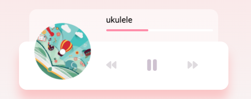

## Music Player

Create beautiful UI to play music stored in the "music folder" using the HTML5 audio API

## Project Specifications

- Create UI for music player including spinning image and song detail popup
- Add play and pause functionality
- Switch songs
- Progress bar

# Code snippets worth mentioning

## Music Progress Bar 


To achieve both the progress bar's look and functionality, the following functions were created to allow the automatic width expansion of the progress bar and the ability to skip around the music track.

### Update Progress Bar
```javascript
// Update Progress Bar
function updateProgress(e){
    // get the duration and current time
    const {duration, currentTime} = e.srcElement;
    const progressPercent = (currentTime / duration ) * 100;
    // expand width of progress bar
    progress.style.width = `${progressPercent}%`;
}
```

### Set Progress Bar by click
```javascript
// Set Progress bar by click
function setProgress(e){
    const width = this.clientWidth;
    const clickX = e.offsetX;
    const duration = audio.duration;
    audio.currentTime = (clickX / width) * duration;
}
```
The dark pink line indicates the current location of the song. It is being controlled by the `updateProgress(e)` function by getting both the `duration` and the `currentTime` values from the `<audio>` HTML Element.

You can click on the entire line to skip through the track

## CSS Snippets worth mentioning

### Record/CD "hole"/dot

The dot in the middle of the album cover is drawn by using CSS.

```css
.img-container::after{
    content: '';
    background-color: #fff;
    border:1px solid rgb(184, 184, 184);
    border-radius: 50%;
    position: absolute;
    bottom: 100%;
    left:50%;
    height: 10px;
    width: 10px;
    /* Puts the dot right in the middle */
    transform: translate(-50% ,50%);
}
```